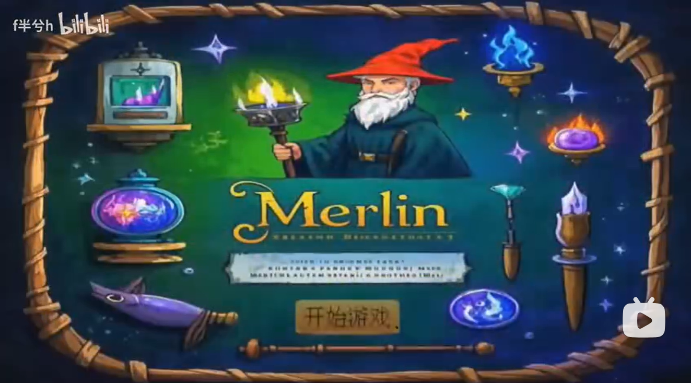
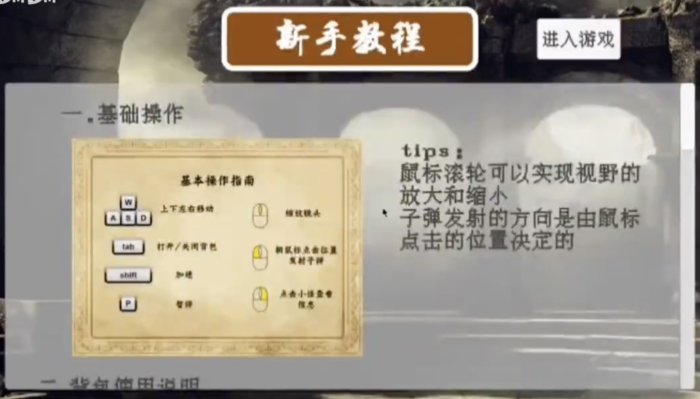

# Introduction to 2D Game Development
<table style="margin: 0 auto;">
  <tr>
    <td>
      
      <figcaption style="margin-top: 8px; text-align: center;">Moment1</figcaption>
    </td>
    <td style="width: 30px;">
        &nbsp
    </td>
    <td>
      
      <figcaption style="margin-top: 8px; text-align: center;">Moment2</figcaption>
    </td>
  </tr>
</table>

---

## COMP561405
### Basic Information
- Course Homepage([Click here](https://html5gameenginegroup.github.io/GTCS-Engine-Student-Projects/2025.3.XJTU/index.html))
- Xi'an Jiaotong University, Computer Experimental Class 2301, 2024-2025 Semester 2
- Repository *Merlin* is the final project,including source code and executable game file for downloading.

### Professor
- 🧑‍🏫 [Kelvin SUNG](https://faculty.washington.edu/ksung/)
- 🧑‍🏫 [Yazhe Tang](https://gr.xjtu.edu.cn/web/yztang)

---

## Merlin
- Be your own magician 🧙
- Explore __a diversity of__ magic elements and 🪄 create your __own__ magic arts
- Travel through __different magical worlds__ and __defeat__ perilous enemies 🦹

### How to Play
- Download the game file `Merlin_v0.1.0_Windows.zip` from the **release**.
- Unzip the game file and run `Merlin.exe` to start your journey! (need Windows Operating System)
- We provide detailed game instructions in the login interface👇.

### Game's Splendid Moments
[Splendid Moments](https://www.bilibili.com/video/BV1i5QBYBEwg/?vd_source=b0d1dd10fcd3289aa9583d9cb680fb64)

### Our Team
💪 Team Merlin, consisting of 4 undergraduates in XJTU, spare no effort to create their own computer magic. 
Team members:
- 👨‍🎓 [Tianyi Liu](https://github.com/Leotydk671)  
- 👨‍🎓 Zihang Yang  
- 👨‍🎓 Shengqi Zhang  
- 👨‍🎓 [Yibo Li](https://github.com/Yibo-Li4110)
