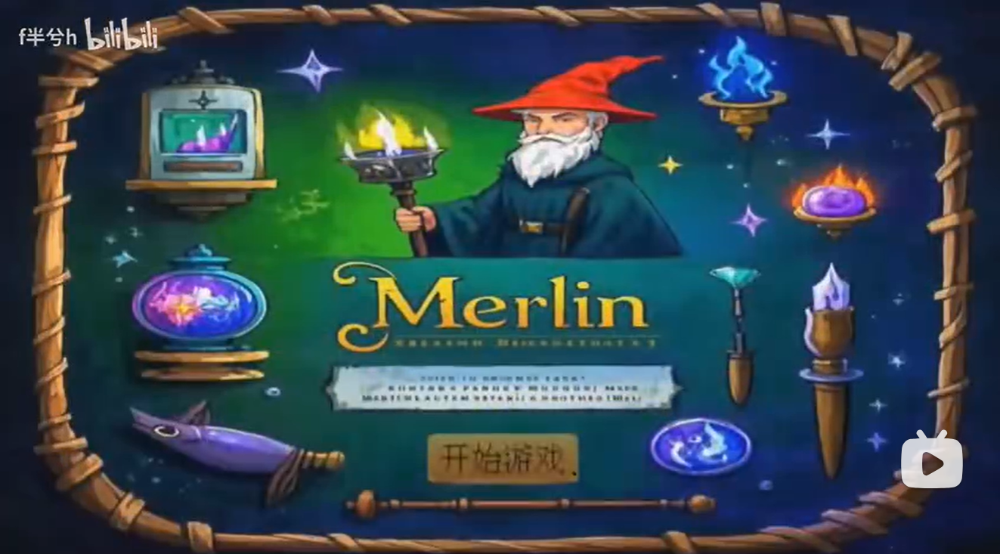
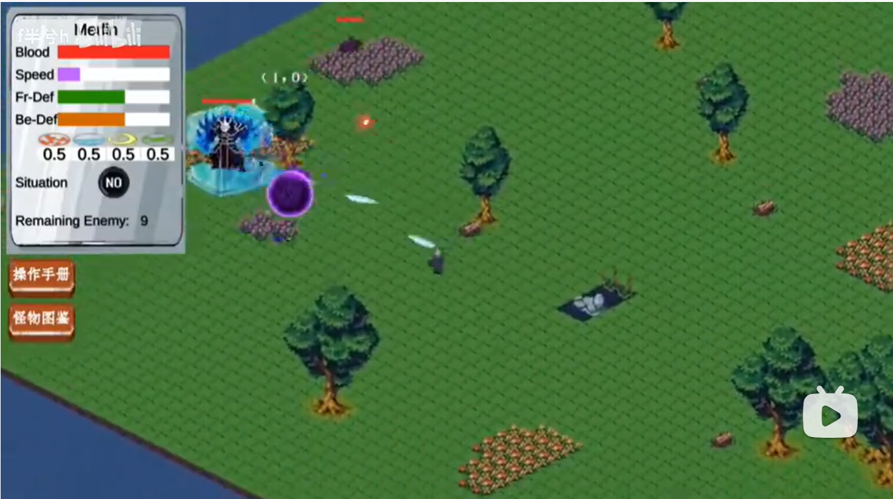

# Merlin
## Development of 2D Game
## Professor
- Kelvin SUNG
- 唐亚哲

## Merlin
- Explore __a diversity of__ magic elements
- Create your __own__ magic arts
- __Beat__ the enemies
- **Enjoy yourself**

## Game's Splendid Moments
<table style="margin: 0 auto;">
  <tr>
    <td>
      
      <figcaption style="margin-top: 8px; text-align: center;">Moment1</figcaption>
    </td>
    <td style="width: 30px;">
        &nbsp
    </td>
    <td>
      
      <figcaption style="margin-top: 8px; text-align: center;">Moment2</figcaption>
    </td>
  </tr>
</table>

## Xi'an Jiaotong University

## Computer Experimental Class 2301

## Team3 Membership:
- 刘添毅
- 杨子航
- 张晟祺
- 李奕博
